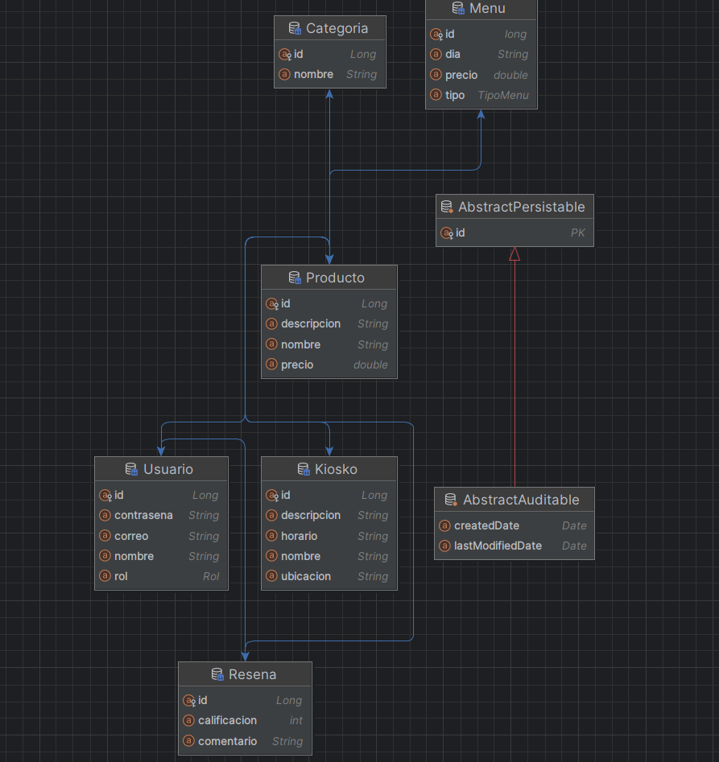

# FoodHub – Backend para gestión de kioskos y menús

## Curso
**CS 2031 – Desarrollo Basado en Plataforma**

## Integrantes
- Sebastian Daniel Cangalaya Martinez
- Turco Salas, Zahir Jamil
- Guevara Vargas Eduardo Salvador

## 📑 Índice

1. [Introducción](#introducción)  
   1.1 [Contexto](#contexto)  
   1.2 [Objetivos del Proyecto](#objetivos-del-proyecto)  
2. [Identificación del Problema o Necesidad](#identificación-del-problema-o-necesidad)  
   2.1 [Descripción del Problema](#descripción-del-problema)  
   2.2 [Justificación](#justificación)  
3. [Descripción de la Solución](#descripción-de-la-solución)  
   3.1 [Funcionalidades Implementadas](#funcionalidades-implementadas)  
   3.2 [Tecnologías Utilizadas](#tecnologías-utilizadas)  
4. [Modelo de Entidades](#modelo-de-entidades)  
   4.1 [Diagrama de Entidades](#diagrama-de-entidades)  
   4.2 [Descripción de Entidades](#descripción-de-entidades)  
5. [Testing y Manejo de Errores](#testing-y-manejo-de-errores)  
6. [Medidas de Seguridad Implementadas](#medidas-de-seguridad-implementadas)  
7. [Eventos y Asincronía](#eventos-y-asincronía)  
8. [GitHub & Management](#github--management)  
9. [Conclusión](#conclusión)  
10. [Apéndices](#apéndices)  

---

## 🧩 Introducción

### Contexto
En el contexto de la digitalización de servicios de alimentación, muchas instituciones educativas y espacios empresariales enfrentan dificultades para gestionar la oferta y disponibilidad de productos en kioskos o cafeterías. Los procesos manuales generan demoras, errores en pedidos, y complicaciones en la administración de menús y stock.  
**FoodHub** surge como una solución backend integral para gestionar kioskos, productos y menús de forma centralizada, eficiente y segura.

### Objetivos del Proyecto
- Desarrollar una API REST robusta que permita la gestión completa de kioskos y menús.  
- Implementar autenticación y autorización seguras para distintos roles (administradores, vendedores, usuarios).  
- Facilitar la integración con servicios externos y la posibilidad de escalar el sistema mediante contenedores.  
- Asegurar la calidad del código mediante pruebas y buenas prácticas de arquitectura.

---

## 🧠 Identificación del Problema o Necesidad

### Descripción del Problema
Las instituciones con múltiples puntos de venta suelen manejar manualmente la administración de productos, inventarios y horarios de atención. Esto genera inconsistencias entre kioskos, pérdida de datos y una experiencia deficiente para los usuarios.  
El problema principal radica en **la falta de un sistema centralizado** que permita controlar y actualizar menús, precios y disponibilidad en tiempo real.

### Justificación
Resolver este problema es relevante porque mejora la eficiencia operativa de los kioskos, reduce errores humanos, optimiza tiempos de atención y facilita la toma de decisiones basadas en datos. Además, permite escalar el modelo a diferentes sedes sin necesidad de infraestructura adicional significativa.

---

## 💡 Descripción de la Solución

### Funcionalidades Implementadas
El backend de **FoodHub** proporciona una API RESTful con las siguientes funcionalidades:

- **Gestión de usuarios:** registro, inicio de sesión, y administración de roles mediante autenticación JWT.  
- **Gestión de kioskos:** creación, edición y eliminación de kioskos, asignación de administradores y control de estado.  
- **Gestión de productos y menús:** registro de productos, precios, categorías y disponibilidad en menús por kiosko.  
- **Gestión de pedidos:** creación de pedidos, validación de stock, cálculo de totales y actualización de inventario.  
- **Notificaciones por correo electrónico:** envío automático de mensajes en eventos relevantes (por ejemplo, confirmación de registro o pedidos).  
- **Manejo de errores globales:** control centralizado de excepciones mediante controladores globales.  
- **Seguridad:** protección de rutas mediante roles, cifrado de contraseñas y validación de tokens.

### Tecnologías Utilizadas
El proyecto utiliza un stack moderno y escalable basado en Java y Spring Boot:

| Categoría | Tecnologías |
|------------|-------------|
| Lenguaje principal | Java 21 |
| Framework backend | Spring Boot 3.5.6 |
| Seguridad | Spring Security, JWT |
| Persistencia | Spring Data JPA, Hibernate |
| Base de datos | PostgreSQL (Docker) |
| Testing | JUnit, Mockito, Spring Boot Test |
| Correo electrónico | Spring Boot Starter Mail |
| Contenedores | Docker y Docker Compose |
| Control de versiones | Git y GitHub |
| Entorno de despliegue | Maven, GitHub Actions (CI/CD) |

---

## 🧱 Modelo de Entidades

### Diagrama de Entidades
`

### Descripción de Entidades
El modelo de datos sigue un enfoque relacional, reflejando las principales entidades del sistema:

- **Usuario:** contiene información de autenticación y rol. Relación 1:N con Kiosko y Pedido.  
- **Kiosko:** representa cada punto de venta. Está asociado a múltiples menús y productos.  
- **Producto:** almacena los detalles de los artículos vendidos (nombre, precio, categoría, stock).  
- **Menú:** conjunto de productos ofrecidos por un kiosko en un horario determinado.  
- **Pedido:** registro de transacciones realizadas por usuarios, con relación a productos y kioskos.  
- **Rol:** define los niveles de acceso y permisos (ADMIN, VENDEDOR, CLIENTE).

---

## 🧪 Testing y Manejo de Errores

El proyecto aplicó diferentes niveles de pruebas:

- **Pruebas Unitarias:** se realizaron sobre servicios y controladores con **JUnit 5** y **Mockito**, verificando la lógica de negocio, autenticación y persistencia.  
- **Pruebas de Integración:** validaron la comunicación entre capas (repositorio, servicio, controlador) utilizando una base de datos en memoria.  
- **Pruebas de Sistema:** se usaron colecciones de **Postman** para probar los endpoints REST.  
- **Pruebas de Aceptación:** se revisaron flujos completos desde la autenticación hasta la creación de pedidos.

**Resultados:**  
Durante las pruebas se identificaron errores en la validación de tokens JWT y en la lógica de stock, los cuales fueron corregidos mediante controladores de excepciones y validaciones adicionales.  

**Manejo de Errores:**  
El backend implementa un manejador global de excepciones (`@ControllerAdvice`) para capturar y devolver respuestas JSON estandarizadas, mejorando la experiencia del cliente y evitando fugas de información sensible.

---

## 🔒 Medidas de Seguridad Implementadas

### Seguridad de Datos
- **Cifrado de contraseñas:** mediante `BCryptPasswordEncoder`.  
- **Autenticación JWT:** cada usuario recibe un token firmado para acceder a los endpoints protegidos.  
- **Roles y permisos:** uso de `@PreAuthorize` para restringir el acceso según el rol del usuario.  
- **Ocultamiento de información sensible:** no se exponen datos críticos en las respuestas de API.  

### Prevención de Vulnerabilidades
- **Inyección SQL:** mitigada gracias a JPA y consultas parametrizadas.  
- **Cross-Site Scripting (XSS):** se validan entradas y salidas para evitar contenido malicioso.  
- **CSRF:** protección mediante tokens y cabeceras en peticiones autenticadas.  
- **Gestión de errores controlada:** se evita el envío de trazas del servidor al cliente.

---

## ⚙️ Eventos y Asincronía

El sistema utiliza eventos asincrónicos para mejorar la eficiencia de ciertas operaciones:

- **Envió de correos electrónicos:** el envío de notificaciones se maneja de forma asincrónica con `@Async` y `@EnableAsync` para no bloquear el flujo principal.  
- **Procesamiento de pedidos:** algunos cálculos se ejecutan en hilos separados para optimizar el rendimiento bajo alta carga.  
- **Importancia:** la asincronía garantiza una experiencia fluida y escalabilidad del sistema, evitando cuellos de botella en procesos secundarios.

---

## 🏁 Conclusión

### Logros del Proyecto
- Se logró implementar un backend funcional, modular y seguro.  
- Se estableció una arquitectura sólida basada en microservicios escalables.  
- Se integraron mecanismos de seguridad y pruebas automáticas que garantizan confiabilidad.

### Aprendizajes Clave
El desarrollo de **FoodHub** permitió fortalecer conocimientos en:
- Arquitectura de software con Spring Boot.  
- Buenas prácticas de desarrollo y seguridad.  
- Importancia del testing y la integración continua.  

### Trabajo Futuro
- Incorporar análisis estadísticos de ventas y preferencias de usuarios.  
- Implementar un panel de administración frontend.  
- Integrar pasarelas de pago y reportes automáticos.  
- Extender las funcionalidades de reseñas con IA para análisis de sentimientos.  

---

## 📎 Apéndices

### Licencia
Este proyecto se distribuye bajo la **Licencia MIT**, permitiendo su uso, modificación y distribución con fines académicos o personales.

### Referencias
- Documentación oficial de [Spring Boot](https://spring.io/projects/spring-boot)  
- Guía de [Spring Security](https://spring.io/guides/topicals/spring-security-architecture/)  
- [JSON Web Tokens (JWT)](https://jwt.io/introduction/)  
- [JUnit 5 User Guide](https://junit.org/junit5/docs/current/user-guide/)  
- [Mockito Framework](https://site.mockito.org/)  
